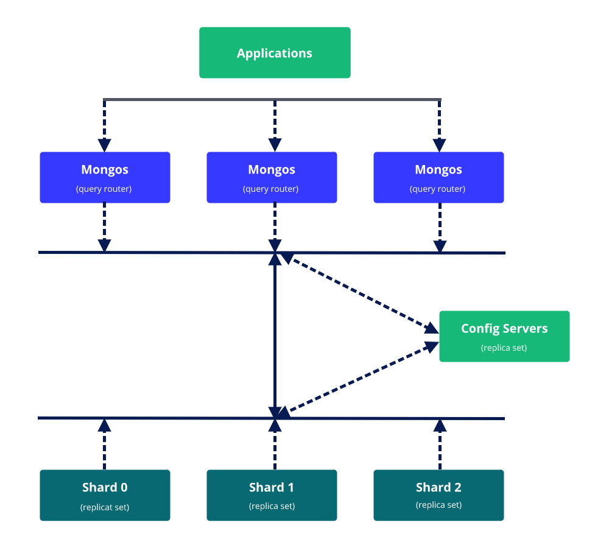

## Introduction

Sample MongoDB sharded cluster with SSL enabled. This cluster will run on a single machine, each component will start on separate process & port.
This cluster partitioned into three shards, each shard contains two data members and one arbitrary member.

## Architecture



## Pre-requisites

* MongoDB
* OpenSSL
* NodeJS
* Bash

## Step-1: Prepare SSL certificate

For production use, your MongoDB deployment should use valid certificates generated and signed by a single certificate authority.
You or your organization can generate and maintain an independent certificate authority, or use certificates generated by a
third-party SSL vendor.

For demonstration purpose you can generate [self sigined certificate.](./self-signed-certificate.md)

Generate a client certificate for web app & an admin-client for cluster administration, copy all certificates to `/opt/mongodb/`.
Set only read permission for these certificates.

```
cd /opt/mongodb/
chomod 400 *
```

## Step-2: Customize configs for your need

Confs directory contains cluster components configurations, You can customize for your needs.
Make sure that your data directory & log directory have read & write permissions.
By default data directory pointed on `/data/mongodb/` & log directory pointed on `/var/log/mongodb/test-cluster/`.

## Step-3: Initiate the cluster

Review before run the init script, also configure data directory path & check directory permissions.

```
bash init-shard.sh
```

This will setup all replica sets & Sharded cluster. Also will create two user webapp & appadmin.

View all mongod & mongos processes

```
px aux | grep mongo
```

## Step-4: Connect to a mongos query router

```
mongo --port 27018 --ssl --host database.fluddi.com --sslPEMKeyFile /opt/mongodb/admin-client.pem --sslCAFile /opt/mongodb/CA.pem
```

Authenticate user
```
  db.getSiblingDB("$external").auth(
    {
      mechanism: "MONGODB-X509",
      user: "emailAddress=support@fluddi.com,CN=*.fluddi.com,OU=appadmin,O=Fluddi,L=Dhaka,ST=Dhaka,C=BD"
    }
  )
```

Check cluster status
```
sh.status()
```

This will return something like this:
```
--- Sharding Status --- 
  sharding version: {
    "_id" : 1,
    "minCompatibleVersion" : 5,
    "currentVersion" : 6,
    "clusterId" : ObjectId("5a9acadca09f07b6bb63f076")
  }
  shards:
        {  "_id" : "s0",  "host" : "s0/database.fluddi.com:37017,database.fluddi.com:37018",  "state" : 1 }
        {  "_id" : "s1",  "host" : "s1/database.fluddi.com:47017,database.fluddi.com:47018",  "state" : 1 }
        {  "_id" : "s2",  "host" : "s2/database.fluddi.com:57017,database.fluddi.com:57018",  "state" : 1 }
  active mongoses:
        "3.6.3" : 1
  autosplit:
        Currently enabled: yes
  balancer:
        Currently enabled:  yes
        Currently running:  no
        Failed balancer rounds in last 5 attempts:  0
        Migration Results for the last 24 hours: 
                No recent migrations
  databases:
        {  "_id" : "config",  "primary" : "config",  "partitioned" : true }
                config.system.sessions
                        shard key: { "_id" : 1 }
                        unique: false
                        balancing: true
                        chunks:
                                s0  1
                        { "_id" : { "$minKey" : 1 } } -->> { "_id" : { "$maxKey" : 1 } } on : s0 Timestamp(1, 0) 
        {  "_id" : "fluddi",  "primary" : "s0",  "partitioned" : true }
                fluddi.visitors
                        shard key: { "siteId" : 1, "_id" : 1 }
                        unique: false
                        balancing: true
                        chunks:
                                s0  1
                        { "siteId" : { "$minKey" : 1 }, "_id" : { "$minKey" : 1 } } -->> { "siteId" : { "$maxKey" : 1 }, "_id" : { "$maxKey" : 1 } } on : s0 Timestamp(1, 0)
```

## Step-5: Modify chunk size

Make chunk size smaller for demonstration purpose otherwise, you will need to generate a huge volume of data.
This is only for demonstration purpose, don't do this in production.

```
use config
db.settings.save( { _id:"chunksize", value: 8 } )
```
Now chunk size will be 8MB.

## Step-6: Generate some dummy data to the cluster

* Configure .env file, follow .env.example
* Install packages, use `npm i` or `yarn`
* Run `node index.js`, this will generate 50000 visitor records

## Others

### Check cluster status

```
sh.status()
```

### Gracefully shutdown cluster

Execute following commands from mongos
```
sh.stopBalancer()

# Use sh.getBalancerState() to verify that the balancer has stopped.
sh.getBalancerState()

# Now shutdown server
db.getSiblingDB("admin").shutdownServer()
```

### Start the sharded cluster
```
bash start.sh
```

### Modify chunk size

```
use config
db.settings.save( { _id:"chunksize", value: <sizeInMB> } )
```

### Disable Balancing

```
sh.disableBalancing( "test.visitors")
```

### Create SSL a user

Example:
```
db.getSiblingDB("$external").runCommand(
  {
    createUser: "emailAddress=support@fluddi.com,CN=*.fluddi.com,OU=appadmin,O=Fluddi,L=Dhaka,ST=Dhaka,C=BD",
    roles: [
      { role : "clusterAdmin", db : "admin" },
      { role: "dbOwner", db: "fluddi" },
    ],
    writeConcern: { w: "majority" , wtimeout: 5000 }
  }
)
```

Validate
```
db.getSiblingDB("$external").auth(
  {
    mechanism: "MONGODB-X509",
    user: "emailAddress=support@fluddi.com,CN=*.fluddi.com,OU=appadmin,O=Fluddi,L=Dhaka,ST=Dhaka,C=BD"
  }
)
```